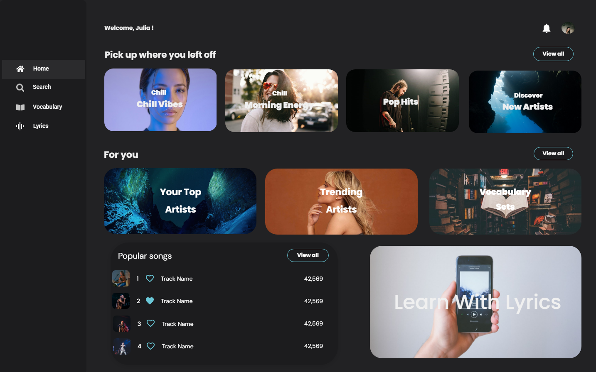
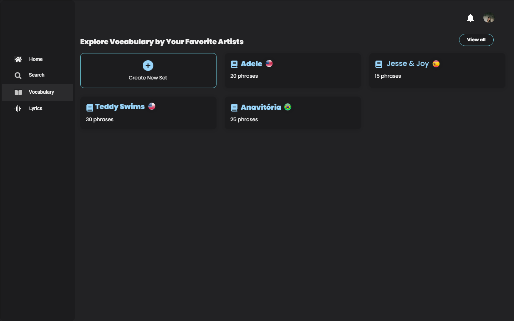

# Language Learning App

### Description
This project is a language learning application that uses song lyrics as a basis to teach new words and phrases. Users can explore lyrics, create vocabulary lists, and practice pronunciation using text-to-speech technology.

### Mockups
Below are mockups of the homepage and vocabulary sections of the application:

## Key Features
- **Explore Song Lyrics**: Users can search and explore song lyrics by artist, genre, or mood.
- **Create Vocabulary Sets**: Users can create and manage vocabulary sets based on song lyrics.
- **Text-to-Speech**: A feature that allows users to hear the correct pronunciation of selected words and phrases.

## Technologies Used so far
- **React**: Used to build the user interface.
- **IBM Watson Text to Speech API**: Used to convert text to audio.
- **Supabase**: Database and authentication.

## Setup Instructions
1. Clone this repository.
2. Install dependencies with `npm install`.
3. Set up environment variables as needed.
4. Run the application in development mode with `npm run dev`.

## Next Steps
- Implement the song lyrics search functionality.
- Improve the user interface based on the mockups.
- Complete integration with the music API to display lyrics.
